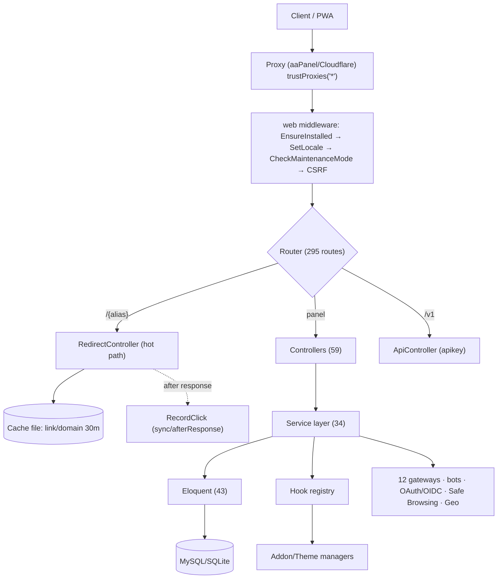
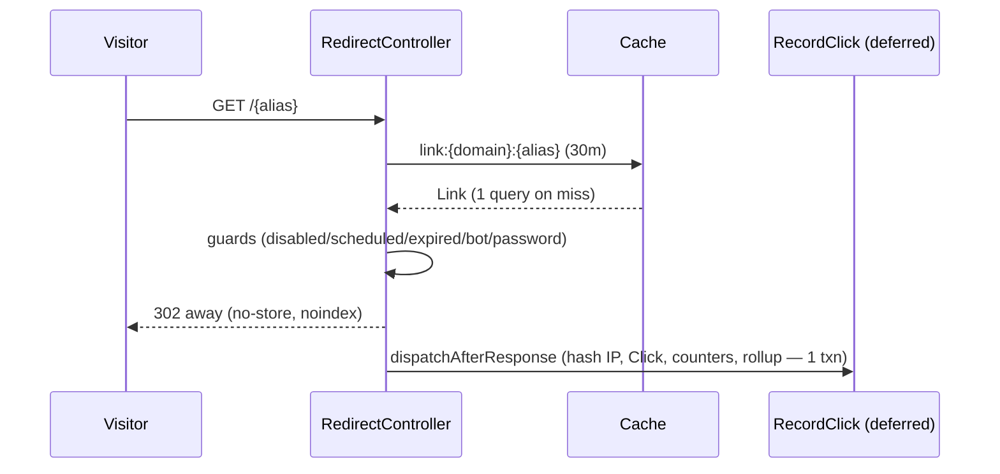
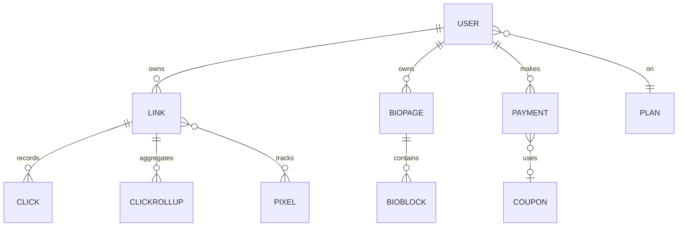

# Shortl Platform — Deep System Audit &amp; Documentation

_Point-in-time, file-referenced reverse-engineering of the self-hosted URL-shortener SaaS at `url.akdwk.in` (Laravel 11.55, v1.6.0). Findings cite `file:line`; unconfirmable items are marked **Cannot Verify**. A rendered version with diagrams and a scorecard is available as a Claude artifact._

**Overall score: 7.2 / 10** — production-capable and feature-dense; held back by near-zero test coverage and a handful of fixable security gaps.

---

## 1. Executive Summary

Shortl is a genuinely production-grade, feature-dense self-hosted alternative to Bitly/Rebrandly, built on a clean Laravel service architecture and engineered to run on cheap shared hosting with **no queue worker and no build step**. Its two weak spots are **near-zero automated test coverage** and a **handful of fixable security gaps** (one stored-XSS, two SSRF in the new public tools, missing HTTP security headers).

**Top strengths**
- Airtight authorization — every owner-scoped resource is ownership-checked (`user_id` checks + `LinkPolicy`); **no IDOR** found.
- Worker-free, cache-first redirect engine — one cached lookup, zero sync writes; click recording deferred via `dispatchAfterResponse`.
- Clean layering — thin controllers, 34-service layer, WordPress-style hook/addon/theme extensibility.
- Deploy-anywhere — committed `vendor/` + pre-built Vite assets + web installer.

**Biggest risks**
- High: Stored XSS via JSON-LD on public pages · 2× SSRF in link-expander/OG-preview tools · Med: no security headers · staff role over-broad on admin routes.
- Critical (business): only placeholder tests — every critical flow unverified by automation.

## 2. Technology Stack

| Layer | Technology | Verdict |
|---|---|---|
| Backend | Laravel 11.55, PHP 8.2+ (runs 8.4) | Current |
| Frontend | Blade + Tailwind 3.4 + Alpine.js 3.15 + Chart.js 4.5 | Solid |
| Build | Vite 6 (assets pre-built &amp; committed to `public/build`) | Good |
| PDF/QR | dompdf 3 · endroid/qr-code 6 | Good |
| DB / ORM | MySQL 8 / SQLite · Eloquent (43 models) | Good |
| Cache / Queue / Session | file / sync / file (Redis optional) | Fine small, cap at scale |
| Auth | Session guard + hand-rolled 2FA/OAuth/OIDC | See §11–12 |
| Logging / Monitoring | stack→single; **no Sentry** | Gap |
| CI/CD | **None** | Gap |

Minimal dependency surface (framework + 2 libraries) — a security asset. Unused: `axios` (imported nowhere), `.skeleton` CSS class.

## 3. Application Architecture

Layered Laravel monolith with a strong service layer and an extensibility spine (hooks + addons + themes).

**Good:** real separation of concerns; idempotency where it matters (payment `fulfil()` lock+status, `RecordClick` single txn + unique-race). **Watch:** no real DB FK constraints (only 2 batch-6 tables); `domain:{host}` cache has no invalidation; layout duplication.

## 4. Feature Inventory (by category)

- **Public:** guest-shorten, pricing, blog+RSS, CMS pages, contact, abuse report, sitemap/robots/manifest/offline. `LandingController`. ✅
- **Links:** CRUD, custom alias, targeting (geo/device/OS/lang/time/rotation), deep links, cloaking, password, expiry/schedule, max-clicks, UTM, pixels, tags, spaces, bulk import/export, duplicate, archive, health-check. `LinkController`/`LinkService`/`TargetingEngine`. ✅
- **QR:** presets, logo, PNG/SVG/PDF, scan tracking. ✅
- **Bio pages:** builder, blocks, themes, templates, subscribers, tips, vCard, public directory. ✅
- **Analytics:** per-link+global, live feed, heatmap, breakdowns, daily rollups, public stats, CSV/PDF, conversions. `StatsService`. ✅
- **Monetization:** plans, subscriptions, coupons, taxes, invoices (PDF), 12 gateways, affiliate/commissions, payouts, credits wallet. `PlanService`/`Gateways/*`. ✅
- **Growth (Batch 6):** link preview pages, creator directory, dynamic OG images, 9 free public tools, programmatic SEO pages, leaderboard, embed widgets, waitlist, share buttons, powered-by badge, status page. `Site/*`. ✅
- **Retention:** web-push (VAPID), badges + streaks, weekly digest, AI bio/title. ✅
- **Auth &amp; account:** register/login, 2FA (TOTP), 5 social providers, OIDC SSO, email verify, password reset, sessions, GDPR export/erase, impersonation. ⚠️ §12
- **Team:** workspaces, invites, roles, activity feed. ✅
- **Developer:** REST API, keys, HMAC webhooks, PHP/JS/Python SDKs, docs. ✅
- **Integrations:** Telegram/Slack/Discord bots, WordPress plugin, browser extension, Zapier. ✅
- **Admin:** users, moderation, payments/payouts, plans/coupons/taxes, content CMS, languages, reports, audit log, addons, backups, self-updater, SSO, waitlist, 15 settings screens. ✅
- **Platform:** web installer, one-click updater, hooks/addons/themes, multi-language (en shipped; gu/hi via DB editor), PWA.

**Partial / dead / disconnected (flagged):** `spaces.parent_id` exists but Space model declares no `parent()/children()` — nested folders appear incomplete. `qr_codes.scans` has no increment site. `links.health_status/code` write path unconfirmed. `.skeleton`/`axios` unused. (Cannot Verify beyond static grep.)

## 5. Page / Route Inventory

295 web + 11 API routes. `/{alias}` redirect registered **last** (constrained) so static/growth paths win. Bot-webhook paths correctly precede `/webhooks/{gateway}`.

| Area | Routes | Protection |
|---|---|---|
| Installer/updater | 10 | none → lock |
| Public/landing | ~19 | public |
| Growth/SEO (public) | ~23 | public + throttle |
| Auth | ~18 | `guest` |
| User panel | ~110 | `auth · not.suspended · verified.setting` |
| Growth (auth) | 6 | `auth · not.suspended` (missing verified-email gate — minor) |
| Admin | ~90 | `auth · admin` |
| Webhooks | 5 | CSRF-exempt + signature |
| Bio-public + catch-all | 8 | public / flag |
| API v1 | 11 | `apikey` |

171 Blade views. All 6 error pages present (403/404/419/500/503/maintenance).

## 6. User Journeys

**Purchase funnel:** Visitor → guest-shorten → register (free plan+referral) → dashboard → create link → quota hit → pricing → `GatewayManager.checkout()` → gateway → return/webhook → `PlanService.fulfil()` (idempotent, invoice, commission).

**Click hot path (sequence):**

Other journeys: 2FA login, bio tip, API link create, admin impersonation (all verified).

## 7. Frontend Audit

**Strengths:** single root layout; 7 reusable components (`x-field` 51×, `x-confirm` 28×, `x-modal` 13×…); real design system in `app.css`; mobile-first (bottom nav, 44px targets, bottom-sheet modals); dark mode pre-paint (no FOUC); pre-built assets.

**Issues:** query-in-view in landing footer (`landing.blade.php:85`, runs on every public render); layout scaffold duplicated app↔admin; dead `.skeleton`/`axios`; large editor views (links/form 347, bio/edit 340); ~20 inline scripts reduce CSP-friendliness.

## 8. Backend Audit

Thin controllers, real services — no fat-controller offenders. Caching keys: `link:*`/`domain:*` (30m), `settings:all`/`default_plan` (1h), `clicks_month:*` (5m), `uniq:*`/`geo:*` (24h). 4 jobs; default sync + `dispatchAfterResponse` = worker-free. Outbound webhooks HMAC-SHA256 signed. 12-gateway abstraction (`Gateway` + `GatewayManager`); webhook signatures for Stripe/Paddle/Coinbase/NowPayments/Razorpay/Xendit (**optional if secret unset**). `domain` cache has no invalidation.

## 9. Database Audit

~40 tables, 11 migrations, 43 models.

- **Hot-path indexes:** optimal — `links (domain_id,alias)` unique, `clicks (link_id,created_at)`+`(user_id,created_at)`, `click_rollups (link_id,date)` unique.
- **Missing indexes (Low):** `commissions.referred_user_id/payment_id`, `payments.plan_id/subscription_id/coupon_id`, `bio_pages.domain_id`, `tips.status/gateway_reference`, `posts.user_id`.
- **FK constraints (Med):** only `push_subscriptions`+`user_badges` real; elsewhere `foreignId()` = indexed column only → orphan rows possible.
- **Soft deletes:** none (hard deletes; `links.archived_at` is a manual flag).
- **Secrets at rest:** `sso_providers.client_secret`, 2FA secret+recovery codes, and settings secrets are `Crypt`-encrypted (verified `SettingsRepository:49`). **But `webhooks.secret` is plaintext** (Low).
- **Counters:** updated atomically in `RecordClick` txn; no reconciliation job (drift possible if clicks bypass the job).

## 10. API Audit

`/v1` under `apikey` middleware; `Authorization: Bearer` → fallback `X-Api-Key`; SHA-256 hash lookup; plan `api` feature + suspension gate; per-key rate bucket with `X-RateLimit-*`. Endpoints: `me`, `links` CRUD+stats+qr, `spaces`, `domains`. **No IDOR** — `authorizeLink()` enforces `user_id` match. Missing: published OpenAPI spec.

## 11. Authentication &amp; Authorization

- **Auth:** session guard; bcrypt (`hashed` cast); 2FA TOTP (encrypted secret+recovery); 5 social providers (state+PKCE); OIDC SSO; throttled endpoints; failures logged.
- **Authz:** roles `user/staff/admin`; `role` not mass-assignable; owner checks + `LinkPolicy` (airtight); plan feature gating; impersonation guarded; last-admin protected.
- **Weak spots (→§12):** OAuth/OIDC id_token signatures **not verified** (`decodeJwt` base64-only); SSO nonce generated but unchecked. Staff over-broad — only `UserController` re-checks a specific permission, so a limited staffer can reach Settings/SSO/self-updater routes.

## 12. Cybersecurity Audit

Access control is the strongest area (**zero IDOR**). Real risks:

1. **High — Stored XSS via JSON-LD** (`SeoService.php:40` → `partials/seo-meta.blade.php:53`). `json_encode` lacks `JSON_HEX_TAG` + uses `JSON_UNESCAPED_SLASHES`, printed via `{!! !!}` in `<script type="application/ld+json">`. Link title/bio fields break out → JS on public preview/bio/directory pages. **Fix:** add `JSON_HEX_TAG|JSON_HEX_AMP|JSON_HEX_APOS|JSON_HEX_QUOT`.
2. **High — SSRF, OG-preview tool** (`Site/ToolController.php:170-200`, guard `:240-264`). Unauthenticated; string-only guard (no DNS resolve, misses decimal/hex/IPv6, not per-redirect). Returns metadata from internal/metadata endpoints. **Fix:** resolve→block private ranges, re-validate every hop.
3. **High — SSRF, link-expander** (`ToolController.php:126-161`). Follows up to 10 redirects past the guard; discloses final URL/status/chain.
4. **Med — No security headers** (global): no CSP/X-Frame-Options/nosniff/HSTS/Referrer-Policy → clickjacking, no CSP to blunt XSS.
5. **Med — Custom-pixel stored XSS** (`link/pixels.blade.php:169`): `{!! $pixel->value !!}` runs arbitrary JS on visitors. Gate + CSP.
6. **Med — OAuth/OIDC id_token unverified · staff over-broad** (see §11).
7. **Low — Fail-open** (Slack/Discord/Stripe accept unsigned when secret unset; captcha fails open); **plan fields in `$fillable`** (not currently reachable); **`SESSION_SECURE_COOKIE` unset**.

**Verified strengths:** no SQLi (fixed column lists + bound params); airtight IDOR; image-validated uploads on public disk; no open redirect beyond core; secrets encrypted; `.env` not committed; `APP_DEBUG=false`; DomPDF remote disabled; CSPRNG tokens; 2FA data encrypted.

## 13. Performance

Fast by design: cached redirect (1 lookup, 0 sync writes); analytics from pre-aggregated rollups; denormalized counters; pre-built hashed assets; bots skip recording. Quick wins: fix query-in-view; Redis+worker at scale; add missing indexes; `domain` cache invalidation; move outbound HTTP off the sync after-response window.

## 14. SEO Audit

Strong post-Batch-6: unified meta/canonical, OG + dynamic OG images, rich sitemap (up to 5,000 bio pages), blog/directory RSS, programmatic pages, good internal linking. **Caveat:** the JSON-LD layer carries the XSS (§12 #1) — fix first. Image alt present; tool-form inputs lack labels (§16).

## 15. UI/UX Audit

Consistent, mobile-first, well-componentized; coherent design system across 171 views; filterable menu arrays for addon extensibility. Minor: very large editor views; toast auto-dismiss has no pause-on-hover.

## 16. Accessibility

**Strong:** `aria-label` 92×, icons `aria-hidden`, modals `role=dialog`/`aria-modal`, 44px targets, visible focus, all `` have `alt`, `x-field` labels (51×), toast `aria-live`. **Gaps (Med/Low):** free-tool forms use bare `<label>` without `for`/`id`; directory search placeholder-only; no skip-to-content link; toast timing.

## 17. Admin Panel

~90 routes, 46 views, 15 settings screens. Roles: super `admin` + `staff` (granular `admin.*`). **Permission matrix under-enforced** — only `UserController` self-checks; SelfUpdate/Settings/SSO/Backup rely on the `admin` middleware that admits any staff. **Recommendation:** gate high-blast-radius controllers on `isSuperAdmin()`/specific `can('admin.x')`, or split the route group by permission.

## 18. Third-Party Integrations

12 gateways (encrypted keys, HMAC webhooks — 6 verified, optional if secret unset); SMTP (encrypted); Telegram (secret path `hash_equals`); Slack/Discord (HMAC/Ed25519 — accept if secret unset); Safe Browsing (fails safe); Geo (CF→MaxMind→ip-api); OAuth/OIDC (state/PKCE, id_token unverified); WordPress/Extension/Zapier/SDKs (Bearer API key).

## 19. Error Handling

All 6 error views present; external calls wrapped in try/catch with fallbacks; allowlist validation everywhere. Gaps: no centralized error tracking; a few fail-open paths (captcha, unsigned webhooks).

## 20. Testing Audit

**The single biggest weakness.** Only placeholder tests (`ExampleTest`). Effective critical-flow coverage ~0% — auth, 2FA, OAuth/SSO, billing fulfil/idempotency, webhooks, RBAC/impersonation, plan limits, installer, self-updater all unverified. No CI. **First tests:** billing idempotency, IDOR regression (web+API), redirect guards, quota enforcement, SSRF guards (post-fix).

## 21. DevOps &amp; Production Readiness (7/10)

Installer (5-step, lock file); updater (GitHub zipball overwrite + `migrate --force`, preserves env/storage, **never deletes removed files**); backups (SQL/SQLite stream); scheduler (heartbeat, prune-clicks, subscriptions, health, digests); `/up` + `/status`; `public/index.php` first-run `.env`+APP_KEY bootstrap. **Missing:** Sentry, CI/CD. Secrets: `.env` git-ignored, DB secrets encrypted, `APP_DEBUG=false`.

## 22. Code Quality &amp; Technical Debt

Good: consistent naming/PSR-4, thin controllers, DRY services, single link-creation path, hooks/addons/themes, transactions+locks. Debt: **no tests (P0)**; layout duplication; query-in-view; dead code; inline scripts vs CSP; no FK constraints.

## 23. AI &amp; Automation Opportunities (ROI-positive only)

AI tagging/naming (Low, extend `AiService`); anomaly/fraud detection on click spikes (Med); NL weekly insights email (Low); AI abuse triage (Med); smart routing suggestions (Med). Skip AI where rule-based targeting/rollups already suffice.

## 24. Business &amp; Revenue

Quota-gate upsell exists — instrument drop-off; free-tools funnel needs "sign up to save" CTAs + conversion tracking; directory/leaderboard drive backlinks; surface the built-in affiliate program; add proactive renewal reminders.

## 25. Scalability

| Scenario | Today | Change |
|---|---|---|
| 10× users | Fine | Add missing indexes |
| 100× clicks | Bottleneck | Redis cache+queue, worker-side click writes |
| 10× DB | Watch | Partition/prune clicks; rely on rollups |
| High concurrency | Single-node | Shared Redis + LB + multi-node |
| 3rd-party outages | Mostly graceful | Queue outbound HTTP fully |

SPOFs: file cache/session (node-local), sync queue. Deliberate for cheap hosting; swaps cleanly to Redis.

## 26. Critical Issues (ranked)

| # | Issue | Sev | Location | Fix | Effort |
|---|---|---|---|---|---|
| 1 | Stored XSS via JSON-LD | High | `SeoService.php:40` | JSON_HEX_* flags | Trivial |
| 2 | SSRF — OG-preview | High | `ToolController.php:170` | Resolve+block private IPs, per-hop | Small |
| 3 | SSRF — link-expander | High | `ToolController.php:126` | Same guard | Small |
| 4 | No test coverage | Crit* | `tests/` | Critical-path suite + CI | Large |
| 5 | No security headers | Med | global | Headers middleware | Small |
| 6 | Custom-pixel XSS | Med | `link/pixels.blade.php:169` | Gate + CSP | Small |
| 7 | Staff over-broad | Med | `AdminOnly.php` | Per-permission/super-admin gates | Small |
| 8 | id_token unverified | Med | `SsoController:112` | Verify signature+nonce | Medium |
| 9 | Unsigned-webhook fail-open | Low | gateways/bots | Reject when secret unset | Small |
| 10 | Session cookie not secure | Low | `session.php:172` | `SESSION_SECURE_COOKIE=true` | Trivial |

_*Testing debt rated Critical for a payments SaaS despite being non-exploitable — highest business risk._

## 27. Priority Matrix

- **P0 (now):** XSS (#1), SSRF (#2,#3), security-headers (#5), secure cookie (#10) — all small.
- **P1 (high):** test suite + CI (#4), staff gating (#7), custom-pixel gating (#6), reject unsigned webhooks (#9).
- **P2 (medium):** verify id_tokens (#8), missing indexes, `domain` cache invalidation, Sentry, a11y labels.
- **P3 (low):** Redis/worker, FK constraints + soft deletes, remove dead code, split large views, finish/drop nested folders, OpenAPI.

## 28. Overall Score

| Dimension | Score |
|---|---|
| Functionality | 9.0 |
| Code Quality | 8.0 |
| Architecture | 8.2 |
| Security | 6.0 |
| Performance | 8.2 |
| UI/UX | 8.2 |
| Accessibility | 7.0 |
| SEO | 8.8 |
| Scalability | 6.5 |
| Testing | 2.0 |
| DevOps | 7.0 |
| Production readiness | 7.2 |
| **Overall (weighted)** | **7.2** |

Security (6.0) and Testing (2.0) are the outliers. Fixing P0 security + a critical-path test suite lifts the overall to ~8.3.

## 29. Recommended Architecture (evolve, don't rewrite)

| Layer | Today | At scale (opt-in) |
|---|---|---|
| Cache/session | file | Redis (shared) |
| Queue | sync + afterResponse | Redis + Horizon worker |
| DB | MySQL single | + read replica; partition clicks; FK constraints |
| Edge | app-served | CDN/edge cache for redirects + OG |
| Observability | logs | Sentry + uptime + metrics on `/status` |
| Security | none global | headers/CSP; secret-required webhooks; verified id_tokens |
| CI/CD | manual | GitHub Actions: test → build → deploy |

Every row is a driver/config swap the codebase already anticipates — additive, not a redesign.

## 30. Refactoring &amp; Development Roadmap

1. **Critical fixes** — XSS HEX flags · SSRF resolve-and-block · security-headers middleware · secure cookie.
2. **Stability** — critical-path tests + CI · staff permission gates · reject unsigned webhooks · custom-pixel gating.
3. **Performance** — missing indexes · domain-cache invalidation · fix query-in-view.
4. **Architecture** — FK constraints + soft deletes · verify id_tokens · Sentry.
5. **UX &amp; A11y** — form-label fixes · skip link · split large views · toast timing.
6. **Automation/AI** — AI tagging/insights · anomaly detection · renewal automation.
7. **Scale** — Redis + worker · read replica · CDN edge · OpenAPI.

## 31. Final Recommendations

Shortl is ~90% of the way to enterprise-grade; the remaining 10% is concentrated and well-defined.

1. **This week:** ship the four P0 security fixes (XSS, 2× SSRF, headers) — mostly one-liners.
2. **This month:** critical-path test suite + CI, tighten staff permissions.
3. **This quarter:** observability (Sentry), DB constraints, P2 hardening.
4. **Don't rewrite** — the service layer, hook system, redirect engine and gateway abstraction are assets.

**Bottom line:** a 7.2/10 today that becomes a confident 8.3+/10 after Phases 1–2, with no architectural upheaval.

---
_Generated from a verified, file-referenced static review. Not a substitute for a live penetration test._
